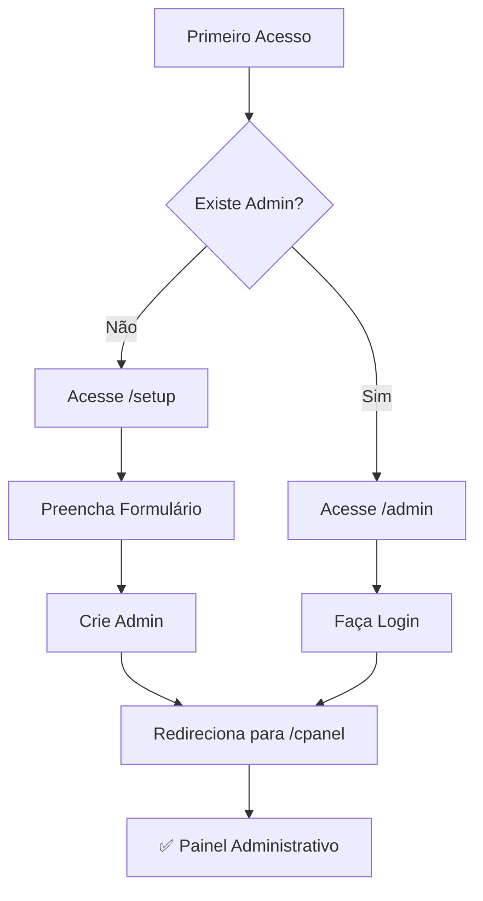

# 🚀 Como Criar o Primeiro Administrador

## 📋 Visão Geral

Existem **2 formas** de criar o primeiro administrador do sistema:

1. ✅ **Interface de Setup** (Recomendado) - Página automática `/setup`
2. ⚙️ **Manual via Firebase Console** - Para casos especiais

---

## 🎯 Método 1: Interface de Setup (Recomendado)

### **Passo a Passo**

1. **Acesse a página de setup:**
   ```
   http://localhost:3000/setup
   ```
   Ou em produção:
   ```
   https://seudominio.com/setup
   ```

2. **Preencha o formulário:**
   - **Nome**: Seu primeiro nome
   - **Sobrenome**: Seu sobrenome
   - **Email**: Email administrativo (ex: admin@flowcutspro.com)
   - **Senha**: Mínimo 6 caracteres
   - **Confirmar Senha**: Digite a mesma senha novamente

3. **Clique em "Criar Administrador"**

4. **Aguarde a confirmação:**
   - ✅ Conta criada com sucesso
   - Você será automaticamente redirecionado para `/cpanel`

5. **Pronto!** Agora você pode acessar o painel administrativo.

---

### **Recursos da Página de Setup**

✅ **Validação Automática**
- Verifica se já existe um admin
- Se existir, redireciona para login
- Impede criação de múltiplos admins pela interface

✅ **Segurança**
- Página só funciona se não houver admins
- Validações robustas de dados
- Confirmação de senha

✅ **Experiência do Usuário**
- Interface visual intuitiva
- Feedback em tempo real
- Mensagens claras de erro

---

## ⚙️ Método 2: Manual via Firebase Console

Use este método se:
- A página de setup não estiver funcionando
- Você precisa criar admin com email específico
- Está tendo problemas técnicos

### **Passo 1: Criar Usuário no Firebase Authentication**

1. Acesse o [Firebase Console](https://console.firebase.google.com/)
2. Selecione seu projeto
3. Vá para **Authentication** > **Users**
4. Clique em **Add User**
5. Preencha:
   - **Email**: admin@flowcutspro.com (ou outro)
   - **Password**: Senha segura (mínimo 6 caracteres)
6. Clique em **Add User**
7. **Copie o UID** que foi gerado (você vai precisar!)

### **Passo 2: Criar Documento no Firestore**

1. No Firebase Console, vá para **Firestore Database**
2. Navegue até a coleção **users**
3. Clique em **Add Document**
4. Configure:
   ```
   Document ID: [Cole o UID copiado acima]
   
   Campos:
   - id (string): [Cole o mesmo UID]
   - firstName (string): "Admin"
   - lastName (string): "Sistema"
   - email (string): "admin@flowcutspro.com"
   - role (string): "admin"  ⚠️ IMPORTANTE!
   - createdAt (timestamp): [Clique em "Use server timestamp"]
   ```

5. Clique em **Save**

### **Passo 3: Fazer Login**

1. Acesse a página de login admin:
   ```
   http://localhost:3000/admin
   ```

2. Use as credenciais criadas:
   - **Email**: O email que você usou
   - **Senha**: A senha que você definiu

3. Você será redirecionado para `/cpanel`

---

## 🔒 Após Criar o Primeiro Admin

### **A Página /setup será Desabilitada**

- Após criar o primeiro admin, a página `/setup` detecta isso automaticamente
- Se alguém tentar acessar, verá uma mensagem:
  ```
  "Sistema Já Configurado"
  ```
- Será redirecionado para `/admin` (login admin)

### **Como Criar Mais Administradores**

Depois do primeiro admin criado, você pode criar mais admins de 2 formas:

#### **Opção A: Via Interface do CPanel**

1. Faça login como admin em `/admin`
2. Vá para `/cpanel/team` (Equipe & Acessos)
3. Clique em "Adicionar Membro"
4. Preencha os dados
5. Selecione **Role**: `admin`
6. Clique em "Criar conta"

#### **Opção B: Via Firebase Console**

1. Crie o usuário no Authentication (Passo 1 acima)
2. Crie o documento no Firestore com `role: "admin"` (Passo 2 acima)

---

## 🚨 Solução de Problemas

### **Problema: "Sistema já configurado" mas não consigo fazer login**

**Solução:**
1. Verifique no Firestore se existe um documento em `/users` com `role: "admin"`
2. Se não existir, crie manualmente (Método 2)
3. Se existir mas não consegue fazer login:
   - Verifique o email no Firebase Authentication
   - Tente resetar a senha no Authentication
   - Verifique se o UID no Authentication corresponde ao UID no Firestore

### **Problema: Página /setup não carrega**

**Solução:**
1. Verifique o console do navegador (F12)
2. Verifique se o Firebase está configurado corretamente
3. Verifique as regras do Firestore
4. Use o Método 2 (Manual) como alternativa

### **Problema: "Permissão negada" ao criar admin**

**Solução:**
1. Verifique as regras do Firestore em `firestore.rules`
2. A regra para `/users/{userId}` deve permitir criação:
   ```javascript
   allow create: if isOwner(userId) && request.resource.data.id == userId;
   ```
3. Deploy das regras:
   ```bash
   firebase deploy --only firestore:rules
   ```

### **Problema: Admin criado mas não consegue acessar /cpanel**

**Solução:**
1. Verifique no Firestore se o campo `role` está exatamente como `"admin"` (minúsculas)
2. Faça logout e login novamente
3. Limpe o cache do navegador
4. Verifique o console do navegador para erros

---

## 📊 Verificação de Admin no Firestore

**Estrutura correta do documento:**

```
/users/{uid}
  ├─ id: "abc123..." (string)
  ├─ firstName: "Admin" (string)
  ├─ lastName: "Sistema" (string)
  ├─ email: "admin@flowcutspro.com" (string)
  ├─ role: "admin" (string) ⚠️ IMPORTANTE!
  └─ createdAt: October 12, 2025 at 3:30:00 PM (timestamp)
```

**Verificação rápida via Firestore:**
1. Abra Firestore Database
2. Vá para coleção `users`
3. Procure por documentos com campo `role = "admin"`
4. Se não encontrar nenhum, a página `/setup` estará disponível

---

## 🎯 Fluxo Completo



---

## 🔐 Segurança

### **Proteções Implementadas**

✅ Página `/setup` só funciona se não houver admins  
✅ Verificação em tempo real no backend  
✅ Validações robustas de dados  
✅ Confirmação de senha obrigatória  
✅ Email único (Firebase Auth)  
✅ Logs de criação do admin  

### **Recomendações**

⚠️ **Use um email seguro** para o admin principal  
⚠️ **Senha forte** com mínimo 8 caracteres (mix de letras, números, símbolos)  
⚠️ **Guarde bem as credenciais** - Sem elas, você não terá acesso ao sistema  
⚠️ **Crie um segundo admin** como backup assim que possível  
⚠️ **Ative 2FA** (Two-Factor Auth) quando disponível  

---

## 📝 Checklist de Setup

- [ ] Acessei `/setup` ou criei admin manualmente
- [ ] Verifiquei que o usuário tem `role: "admin"` no Firestore
- [ ] Consegui fazer login em `/admin`
- [ ] Fui redirecionado para `/cpanel` com sucesso
- [ ] Consigo ver o painel administrativo completo
- [ ] A página `/setup` agora mostra "Sistema já configurado"
- [ ] Criei um segundo admin como backup (recomendado)

---

## 🆘 Suporte

Se ainda tiver problemas:

1. **Verifique os logs do navegador** (F12 > Console)
2. **Verifique os logs do Firebase** (Firebase Console > Functions > Logs)
3. **Consulte a documentação** em `/docs`
4. **Verifique as regras do Firestore** em `firestore.rules`

---

## 🎉 Sucesso!

Após seguir estes passos, você terá:
- ✅ Primeiro administrador criado
- ✅ Acesso ao painel `/cpanel`
- ✅ Capacidade de criar mais admins
- ✅ Sistema totalmente funcional

**Próximo passo:** Explore o painel administrativo e crie sua primeira barbearia! 🚀

---

**Criado em:** 12/10/2025  
**Versão:** 1.0.0  
**Status:** ✅ Documentação Completa

